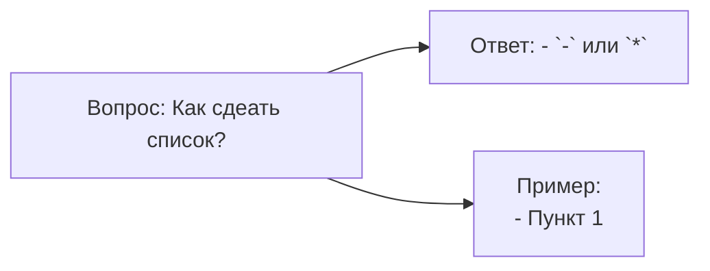
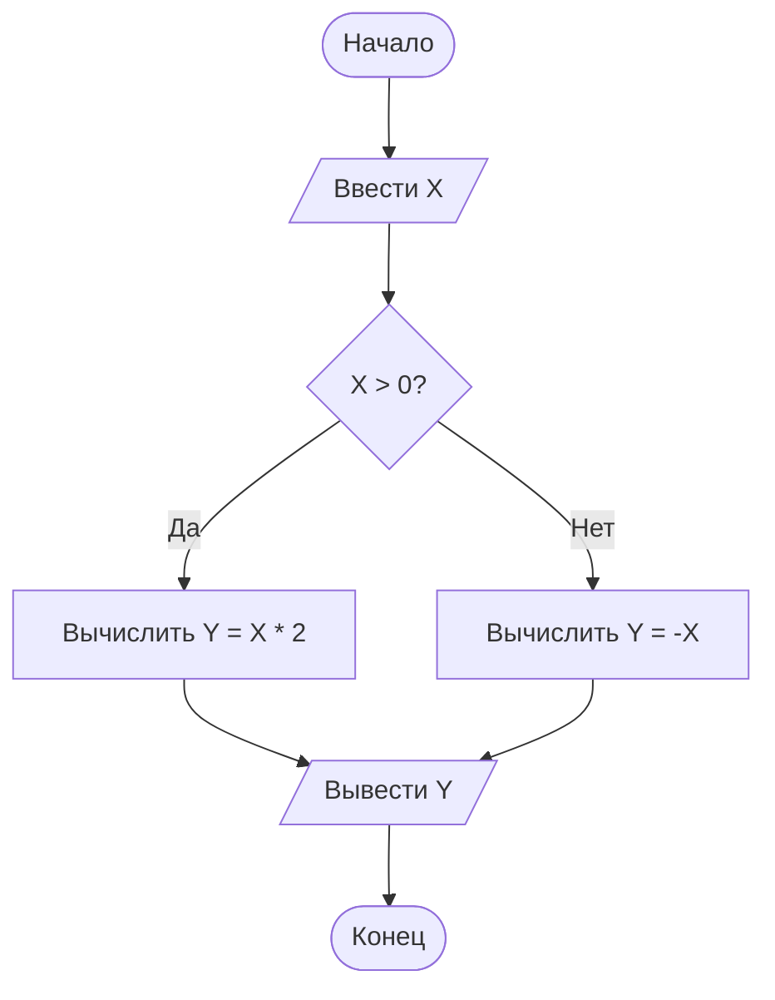
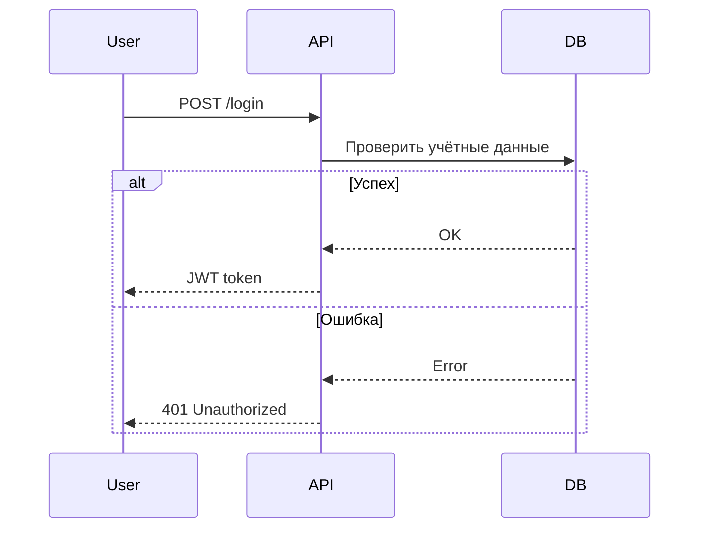
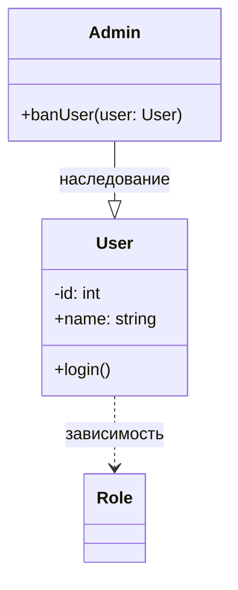
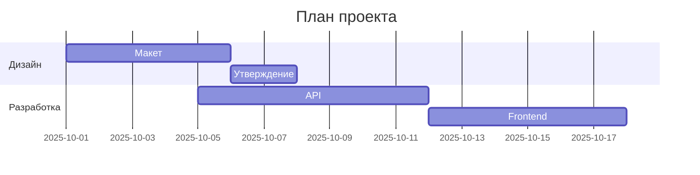
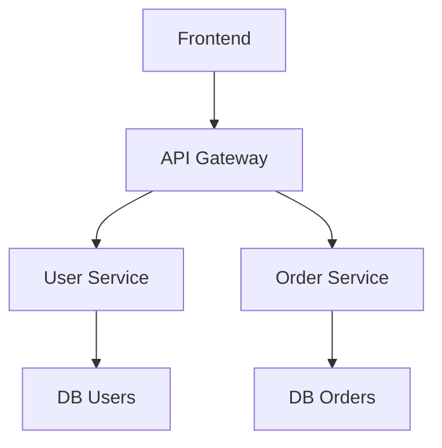
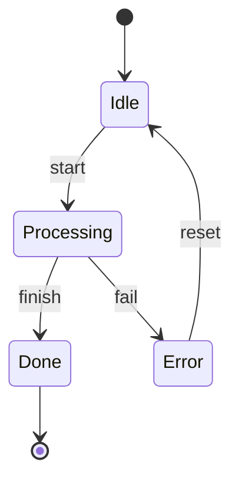
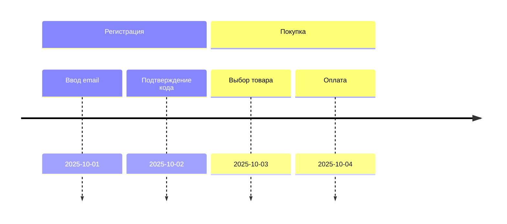
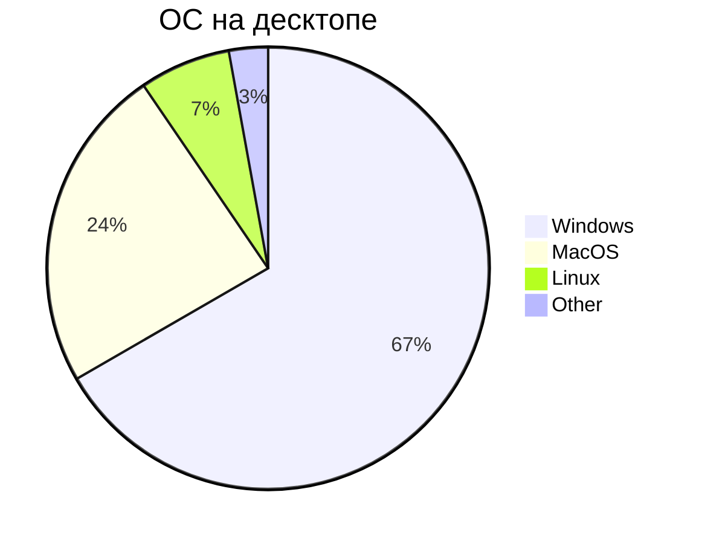

## Mermaid

**Mermain** - это сильно упрощенный и далекий аналог **UML** - спец. язык описания блок схем, графиков и диаграмм с их визуализаций.

Блок схемы
#### Базовая структура 1



* flowchart - блок схема
* LR - направление вправо
* A[], B[], C[] - прямоугольник
* --> - стрелка связи
#### Базовая структура 2

#### Полный  синтаксис блок-схем


### Диаграмма последовательности


### Диаграмма класса

### Диаграмма Ганта


### Граф зависимостей

### Диаграмма состояний

### Юзер Джайрни

### Кастомизация стилей
```mermaid
%%{init: {'theme': 'base', 'themeVariables': {'primaryColor': '#ff5500', 'edgeLabelBackground':'#fff'}}}%%
```
### Классы CSS
```mermaid
.card {
    padding: 16px;
    border: 1px solid #ccc;
}
.card.active {
    border-color: #007bff;
    background: #f0f8ff;
}
```
### Интерактивность

#### Круговая диаграмма



